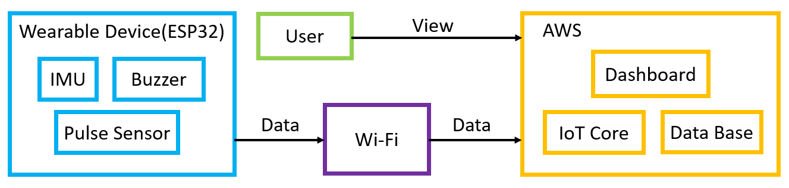

# **Group 5 Project**: Cloud and Fog Computing in the Internet-of-Things

This repository is to store all progress for the project of Group 5 in the course of Cloud and Fog Computing in the Internet-of-Things.

The structure of the repository is as follows:

```bash
Directory structure:
└── raidantimosquitos-cf-iot-spring-25-project/
    ├── README.md
    ├── website/
    ├── src/
    └── .github/
        └── workflows/
            └── deploy.yml
```

---

## Website Directory (`website/`)

Contains all the files for the website of the project.

---

## Source code Directory (`src/`)

Contains all source code for our device, dashboard, AWS scripts, etc.

The demo dashboard [link](https://g-0ccaa910f7.grafana-workspace.ap-northeast-1.amazonaws.com/dashboard/snapshot/grRCAbn4bHOS27t0MIPByjxTr91owSfO)



---

## Workflows directory (`.github/workflows/`)

The `deploy.yml` script in `.github/workflows/` is used to deploy the website to GitHub Pages. To do so we use what is known as [GitHub Actions](https://github.com/features/actions). Here is how it works:

- The `deploy.yml` script is triggered by a push to the `main` branch of the repository.
- The script builds the website and deploys it to the `gh-pages-deployment` branch.
- The website is then hosted on GitHub Pages and can be accessed from the following [link](https://raidantimosquitos.github.io/cf-iot-spring-25-project/).

In conclusion, what `gh-pages-deployment` branch contains is the website's source code, which is then served with GitHub pages.
